# 计算机网络基础

## 1. 什么是计算机网络？

计算机网络是一系列**交换机**,**路由器**和**通信链路**组成的网络，其使得多台终端系统连接起来，并且可以互相交换信息。

一台计算机上的应用想和另一台计算机上的应用进行交互，计算机网络实现了（提供了）该服务（功能）。

## 2. 计算机网络服务分层模型

网络分层，每一层代表了一系列协议，这一系列协议解决了类型或相关的问题。

### 2.1 服务模型（Service Model）

分层，每层向上层提供服务，向下层层索取服务。

优势：

1. 为整个网络提供了一个结构化的抽象
2. 每层可以只负责该层的服务
3. 每层只需要知道以及处理下一层的API
4. 每层不需要管其他层的实现细节

劣势：

1. 增加了header（首部），降低了传输效率，因为需要部分数据来传输首部
2. 增加了延迟，因为要处理首部
3. 增加了出错率，因为数据多了首部

### 2.2 常见网络分层模型

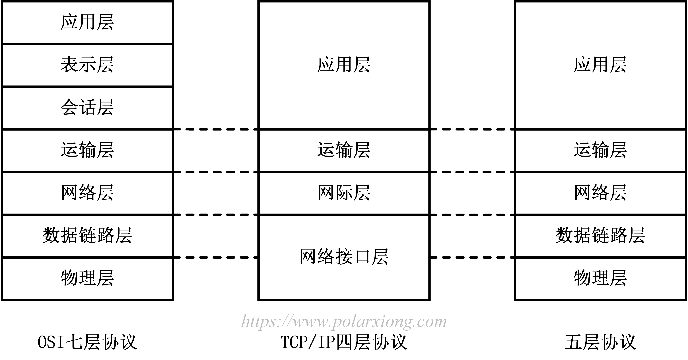

#### 为什么 TCP/IP没有表示层和会话层？

- 因为TCP/IP让开发者来做选择，如果他们需要这些服务的话，他们可以自己开发。

### 2.3 网络分层常见知识总结

### 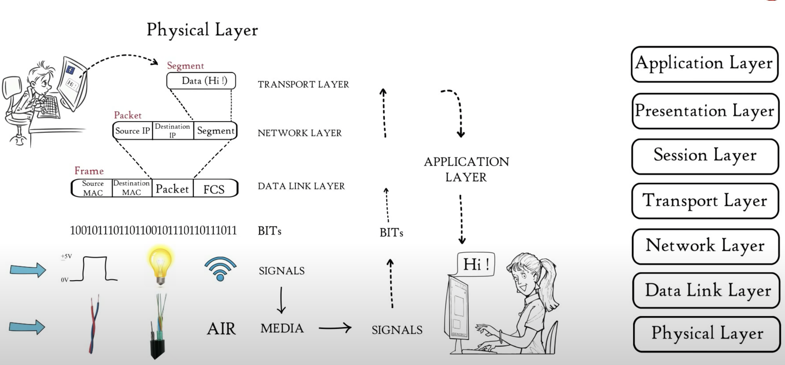

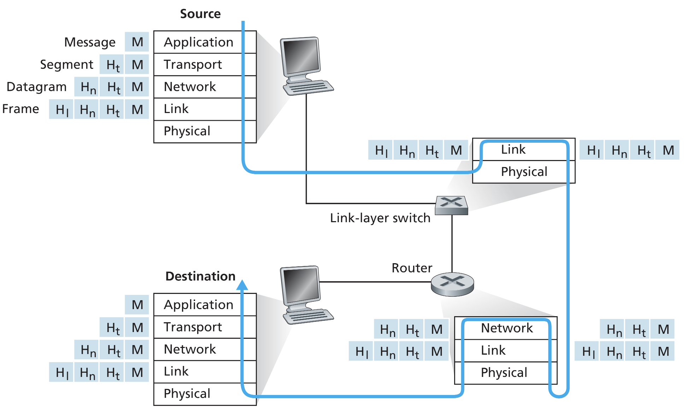

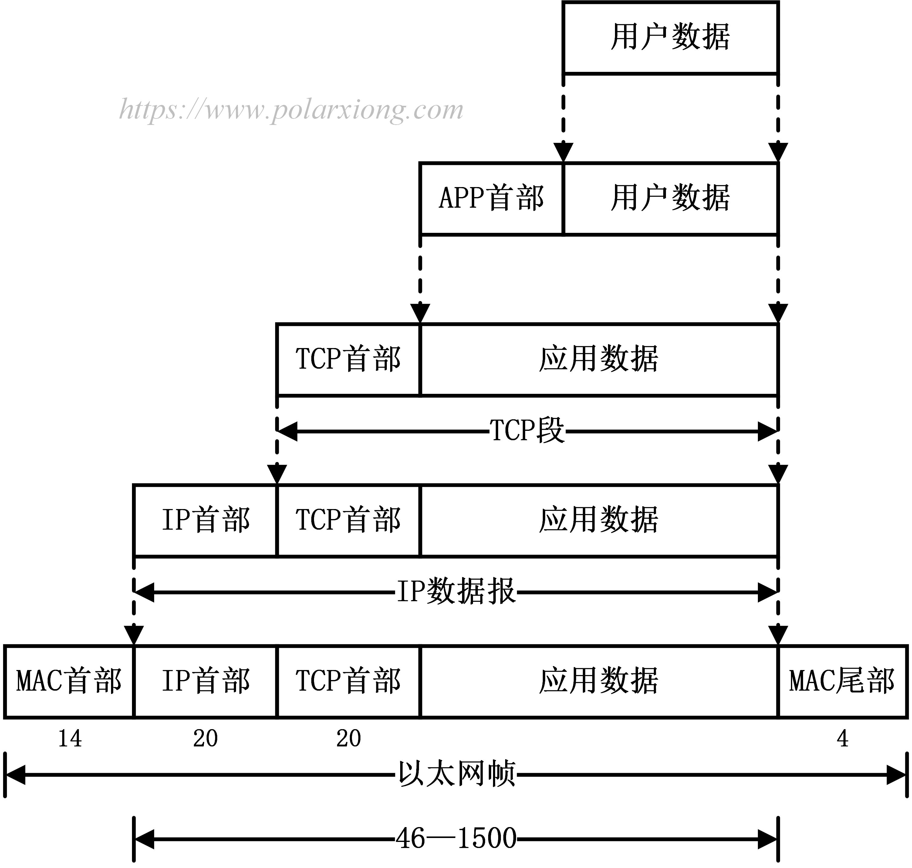

| 分层名称                             | 功能                                                         | 协议                             |
| ------------------------------------ | ------------------------------------------------------------ | -------------------------------- |
| 应用层(Messsage，消息)               | 负责把信息传输到指定的应用，应用对应用。文件，邮件传输。     | FTP, SMTP, HTTP, TelNet, DNS     |
| 表示层                               | 转化(解码)，压缩（加快传输效率）, 加密（SSL）                | ---                              |
| 会话层                               | Authentication(认证), Authorisation（授权）, Session Restoration(Checkpoint & Recovery) | ---                              |
| 运输层(Segment，数据段)              | 负责把信息传输到对应的端口，端口对端口                       | TCP、UDP                         |
| 网络层(Datagram数据报，Packet数据包) | 负责把信息传输到对应的ip地址，主机对主机，负责路由           | IP、ICMP、RIP、OSPF、BGP、IGMP   |
| 链路层(Frame数据帧)                  | 负责MAC地址，在数据进入物理媒介的最后一层，负责媒介之中数据的传输，就是两个传输节点之间的传输 | SLIP、CSLIP、PPP、ARP、RARP、MTU |
| 物理层(Bit，数据位)                  | 负责把二进制数据转换成媒介信号从而进行传输                   | ISO2110、IEEE802                 |

- 常见的浏览器就是负责了三层，应用层，表示层，会话层，例如Chrome。 

- IP地址和MAC地址的区别

  #### 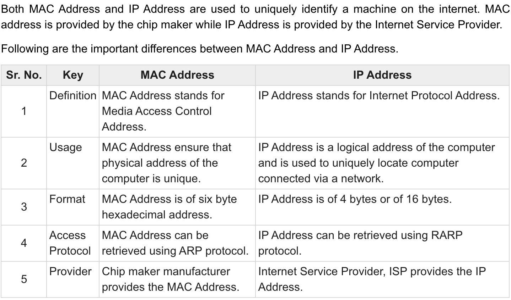

- Difference between Network layer and Data Link Layer

  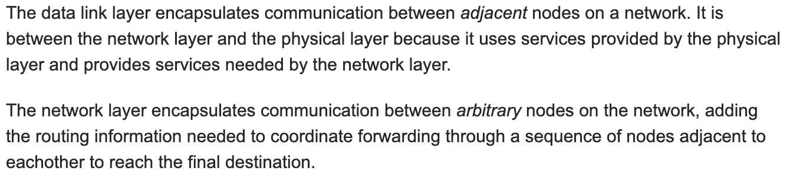

## 3. 应用层

应用层的协议负责应用之间的信息交换，需要考虑应用是Client-Server或者是Peer-to-Peer架构。以及需要选择合适的传输层协议，例如TCP, UDP.

### 3.0 接口（Socket）

两个进程（应用）通过接口互相交换信息。

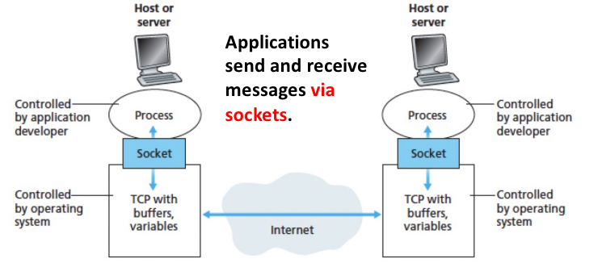

### 3.1 HTTP

- HTTP is called **HyperText Transfer Protocol**

- It uses **client-server architecture**, the web browser implements the client side while the web server implement the server side.

- Use **TCP** as the transport layer protocol
- HTTP is stateless
- 跨域【不懂】

#### 3.1.1 长连接（Persistent） V.S. 短连接（Non-Persistents）

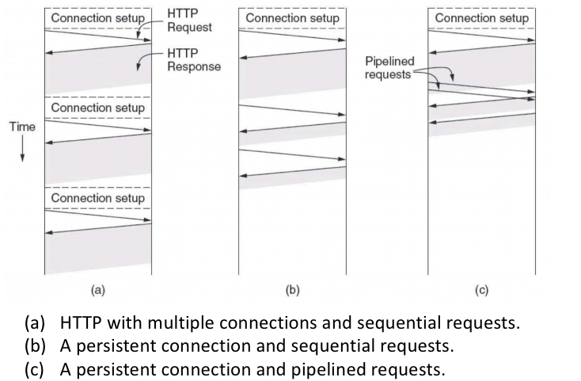

- HTTP默认使用长连接

- 长连接(b, c)和短连接(a)的区别在于TCP连接上。若一个应用每收发一个HTTP消息就连接断开一次TCP则为短连接，反之，若一个应用收发多条HTTP消息且这些消息公用一个TCP连接，则为长连接。
- 长连接的好处就是复用同一个TCP连接，比如打开一个网站，里面有许许多多的HTML，CSS，JS文件，他们通过同一个TCP连接传输肯定比每个文件单独开一个TCP连接来的快。坏处是不易管理
- 短连接的好处是容易管理
- 一般长连接（追求实时性高的场景）用于少数client-end to server-end的频繁的通信，例如：数据库的连接用长连接， 如果用短连接频繁的通信会造成socket错误，而且频繁的socket 创建也是对资源的浪费。
  而像WEB网站的http服务一般都用短链接（追求资源易回收场景），因为长连接对于服务端来说会耗费一定的资源，而像WEB网站这么频繁的成千上万甚至上亿客户端的连接用短连接会更省一些资源。

#### 3.1.2 轮询，长轮询，短轮询

https://cloud.tencent.com/developer/article/1076547

该技术应用与对于消息实时性要求高的应用中，比如网络直播，若服务端数据更新了，则客户端需要第一时间拿到最新数据，所以客户端可以使用轮询技术来实时获取最新的数据。信息实时的推送到客户端，即实现**服务器向客户端推消息的功**能。

轮询：每一个HTTP请求都可以应用轮询，就是在一段时间内不断发起请求来得到数据的技术

短轮询：每次发送的轮询请求，服务器会立马返回数据。客户端判断是否使用收到的数据或者接着轮询

长轮询：客户端发送请求，若服务端的数据没有更新，该请求则会被挂起，等待数据更新才会回复客户端

#### 3.1.2 HTTP Message（消息）

##### 3.1.2.1 请求消息

###### 3.1.2.1.1 格式

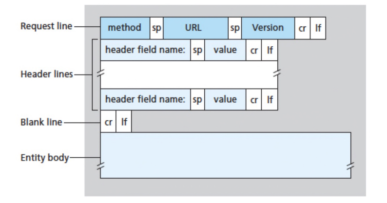

###### 3.1.2.1.2 例子

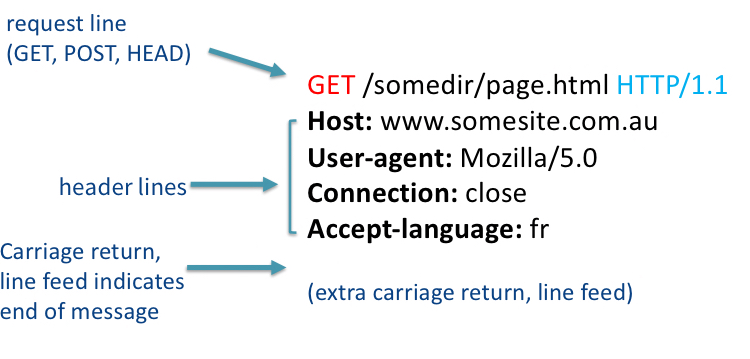

###### 3.1.2.1.3 方法(Method) 【背书】

| 方法         | 描述                                                         | 是否包含主体（Entity Body） |
| ------------ | ------------------------------------------------------------ | --------------------------- |
| GET(查)      | 请求获取Requested-URL所标识的资源                            | 否                          |
| POST（改）   | 向Requested-URL所标识的资源发送需要处理的数据，增加新的资源  | 是                          |
| HEAD         | 只请求获取Requested-URL所标识的资源的首部，用于测试该资源是否存在与服务器中 | 否                          |
| PUT（增）    | 将请求的主体部分存储在服务器，并用Requested-URL作为其标识，完全替换，idempotent | 是                          |
| DELETE（删） | 请求服务器删除Requested-URL所标识的资源                      | 否                          |
| TRACE        | 请求服务器回送收到的请求消息，主要用于测试或诊断             | 否                          |
| OPTIONS      | 请求服务器告知其支持的各种功能                               | 否                          |

###### 3.1.2.1.4 URL

命名了所请求的资源，是一个URL。

###### 3.1.2.1.5 版本 （Version）

报文所使用的HTTP版本，格式为

```text
HTTP/<major>.<minor>
```

其中主要版本号（major）和次要版本号（minor）都是整数。

###### 3.1.2.1.6 首部 （Header Field）

首部和方法配合工作，共同决定了客户端和服务器能做什么事情。

[HTTP Headers Infotmation](./HTTP-Headers.md)


###### 3.1.2.1.7 实体主体（Entity Body）

实体主体就是HTTP负责交换的消息内容。

##### 3.1.2.2 回复消息

###### 3.1.2.2.1 格式

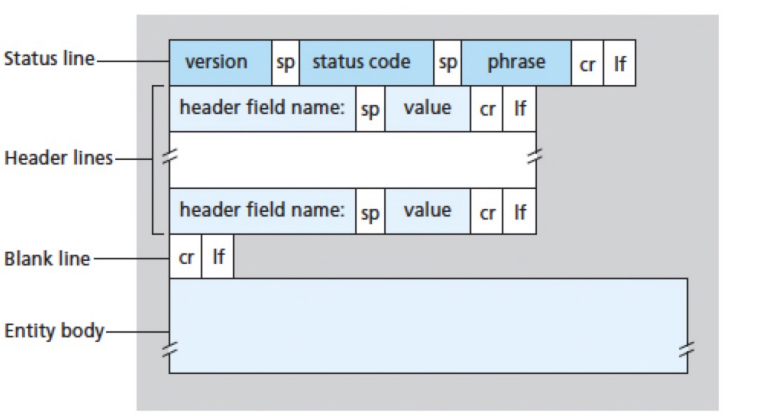

###### 3.1.2.2.2 例子

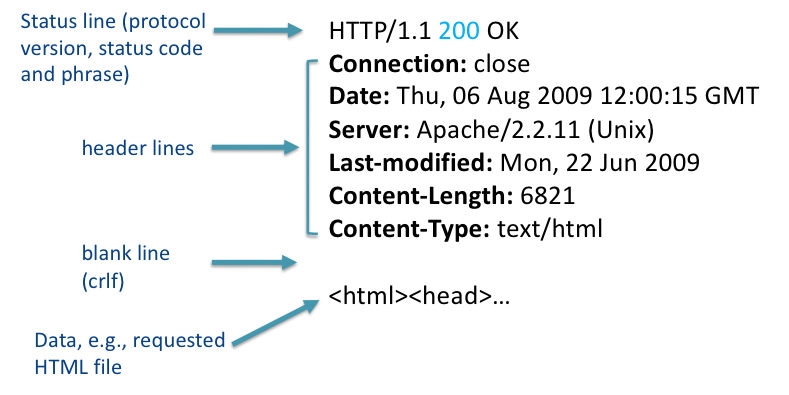

###### 3.1.2.2.3 状态码（Status Code）和短语（Phrase）【背书】

**状态码分类**

| 状态码范围 | 已定义范围 | 分类       |
| ---------- | ---------- | ---------- |
| 100~199    | 100~101    | 消息       |
| 200~299    | 200~206    | 成功       |
| 300~399    | 300~305    | 重定向     |
| 400~499    | 400~415    | 客户端错误 |
| 500~599    | 500~505    | 服务器错误 |

**常见状态码** 】

| 状态码 |         短语          |                             含义                             |
| :----: | :-------------------: | :----------------------------------------------------------: |
|  200   |          OK           |    请求已成功，请求所希望的响应头或数据体将随此响应返回。    |
|  301   |   Moved Permanently   | 被请求的资源已永久移动到新位置，并且将来任何对此资源的引用都应该使用本响应返回的若干个URI之一。 |
|  400   |      Bad Request      |         由于包含语法错误，当前请求无法被服务器理解。         |
|  401   |     Unauthorized      |                    当前请求需要用户验证。                    |
|  403   |       Forbidden       |             服务器已经理解请求，但是拒绝执行它。             |
|  404   |       Not Found       |      请求失败，请求所希望得到的资源未被在服务器上发现。      |
|  408   |    Request Timeout    |                          请求超时。                          |
|  500   | Internal Server Error | 服务器遇到了一个未曾预料的状况，导致了它无法完成对请求的处理。 |
|  503   |  Service Unavailable  |    由于临时的服务器维护或者过载，服务器当前无法处理请求。    |

#### 3.1.3 Cookie

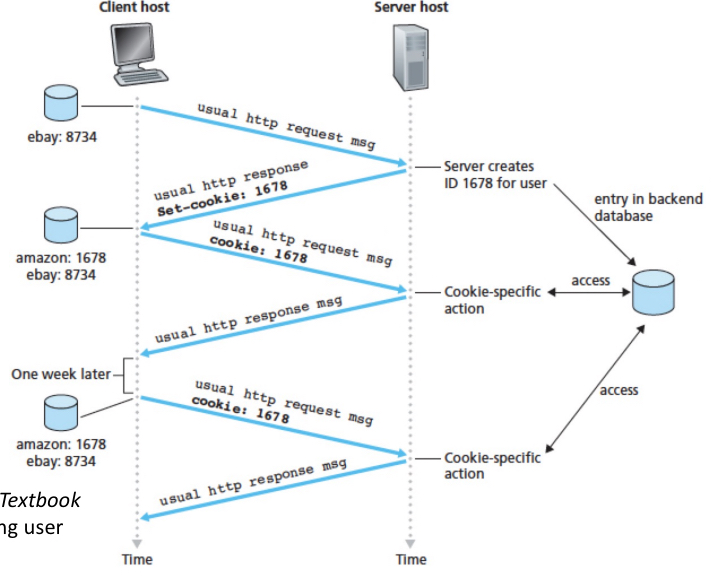

Cookie用来让服务器识别用户，每个用户有唯一的cookie。

1. 客户端向服务器发送http请求
2. 若该客户端没有cookie，服务器生产一个cookie，并且返回cookie给该客户端
3. 该客户端接收到cookie后，保存cookie。并且在接下来的交互中，在每次请求中附加cookie来表明身份

#### 3.1.4 Sessions

session是服务端所保存的用户信息，表示该用户的状态，例如用户使用的语言，喜好的颜色等等。

#### 3.1.5 Token

用户输入账户密码后，服务端发一个token，之后的authentication都通过此token来实现。

Token比Session id更加便于服务端的水平扩展

- 小明在机器A上登录，那session id只会存在于机器A，若去机器B，小明还需重新登录
- 小明在机器A上登录，机器A发给小明一个Token，若去其他机器，其他机器也可以验证小明的Token的validity。

#### 3.1.6 HTTPS

HTTPS - HyperText Transfer Protocol Secure 

HTTPS 就是 TLS/SSL handshae 加上 TCP three-way handshaking

##### SSL/TLS Handshaking【背书】


https://crypto.stackexchange.com/questions/27131/differences-between-the-terms-pre-master-secret-master-secret-private-key


HTTPS其实就是建构在SSL/TLS之上的HTTP协议：


HTTP使用TCP三次握手建立连接，客户端和服务器需要交换3个包；HTTPS除了TCP的三个包，还要加上SSL/TLS握手需要的9个包，共是12个包。

HTTPS和HTTP主要区别：

- HTTPS协议需要到ca申请证书，一般免费证书较少，因而需要一定费用。
- HTTP是超文本传输协议，信息是明文传输，HTTPS则是具有安全性的SSL加密传输协议。
- HTTP和HTTPS使用的是完全不同的连接方式，用的端口也不一样，前者是80，后者是443。

#### 3.1.7 常见问题

##### PUT和POST的区别

- PUT是完全替代掉
- POST是在原来的基础上面加上新的信息

##### Session和Cookie的区别

https://segmentfault.com/a/1190000017831088

- Session是存储在服务器的关于用户的个人状态
- Cookie是存在浏览器的一个id，用来让服务器确认用户的session
- cookie只是实现session的其中一种方案。虽然是最常用的，但并不是唯一的方法。禁用cookie后还有其他方法存储，比如放在url中

##### 分布式下的session如何同步

[分布式系统session同步解决方案](https://www.cnblogs.com/lhl-shubiao/p/10464862.html)

- **session同步法**：多台web-server相互同步数据
- **客户端存储法：**一个用户只存储自己的数据
- **反向代理hash一致性：**四层hash和七层hash都可以做，保证一个用户的请求落在一台web-server上
- **后端统一存储：**web-server重启和扩容，session也不会丢失

##### Cookie和Session的局限以及Token

[Cookie和Session的局限](https://www.cnblogs.com/moyand/p/9047978.html)

[广泛意义上的Session及其框架中的应用](https://www.zhihu.com/question/315397046)

##### Token比Session id更加便于服务端的水平扩展

- 小明在机器A上登录，那session id只会存在于机器A，若去机器B，小明还需重新登录
- 小明在机器A上登录，机器A发给小明一个Token，若去其他机器，其他机器也可以验证小明的Token的validity。-> 但是，问题就是，用户的状态存到哪里去了呢？使用sessino的话，会保存在服务端的session对象中。

##### HTTP响应码301和302的区别？

301：永久重定向。是当用户或搜索引擎向网站服务器发出浏览请求时，服务器返回的HTTP数据流中头信息(header)中的状态码的一种，表示本网页永久性转移到另一个地址。

302：临时重定向。搜索引擎会抓取新的内容而保留旧的网址。因为服务器返回302代码，搜索引擎认为新的网址只是暂时的。

##### SSL和TLS的区别

https://www.jianshu.com/p/cd7b04d6ce82

https://blog.csdn.net/enweitech/article/details/81781405

SSL是TLS的前身

##### HTTP 1.0和HTTP 1.1的区别【不懂】

- 缓存处理：在HTTP 1.0中主要使用header里的`If-Modified-Since`,`Expires`来做为缓存判断的标准，HTTP 1.1则引入了更多的缓存控制策略例如`Entity tag`，`If-Unmodified-Since`, `If-Match`, `If-None-Match`等更多可供选择的缓存头来控制缓存策略。
- 带宽优化及网络连接的使用：HTTP 1.0中，存在一些浪费带宽的现象，例如客户端只是需要某个对象的一部分，而服务器却将整个对象送过来了，并且不支持断点续传功能，HTTP 1.1则在请求头引入了range头域，它允许只请求资源的某个部分，即返回码是206（Partial Content），这样就方便了开发者自由的选择以便于充分利用带宽和连接。
- 错误通知的管理：在HTTP 1.1中新增了24个错误状态响应码，如409（Conflict）表示请求的资源与资源的当前状态发生冲突；410（Gone）表示服务器上的某个资源被永久性的删除。
- Host头处理：在HTTP 1.0中认为每台服务器都绑定一个唯一的IP地址，因此，请求消息中的URL并没有传递主机名（hostname）。但随着虚拟主机技术的发展，在一台物理服务器上可以存在多个虚拟主机（Multi-homed Web Servers），并且它们共享一个IP地址。HTTP 1.1的请求消息和响应消息都应支持Host头域，且请求消息中如果没有Host头域会报告一个错误（400 Bad Request）。
- 长连接：HTTP 1.1支持长连接（PersistentConnection）和请求的流水线（Pipelining）处理，在一个TCP连接上可以传送多个HTTP请求和响应，减少了建立和关闭连接的消耗和延迟，在HTTP 1.1中默认开启Connection： keep-alive，一定程度上弥补了HTTP 1.0每次请求都要创建连接的缺点。

参考：[HTTP,HTTP2.0,SPDY,HTTPS你应该知道的一些事 | AlloyTeam][http_http2_spdy_https_difference]

##### HTTP 1.1和HTTP 2.0的区别 【不懂】

- 新的二进制格式（Binary Format）：HTTP 1.x的解析是基于文本。基于文本协议的格式解析存在天然缺陷，文本的表现形式有多样性，要做到健壮性考虑的场景必然很多，二进制则不同，只认0和1的组合。基于这种考虑HTTP 2.0的协议解析决定采用二进制格式，实现方便且健壮。
- 多路复用（MultiPlexing）：即连接共享，即每一个request都是是用作连接共享机制的。一个request对应一个id，这样一个连接上可以有多个request，每个连接的request可以随机的混杂在一起，接收方可以根据request的id将request再归属到各自不同的服务端请求里面。
- header压缩：HTTP 1.x的header带有大量信息，而且每次都要重复发送，HTTP 2.0使用encoder来减少需要传输的header大小，通讯双方各自cache一份header fields表，既避免了重复header的传输，又减小了需要传输的大小。
- 服务端推送（server push）：server push功能。

参考：[HTTP,HTTP2.0,SPDY,HTTPS你应该知道的一些事 | AlloyTeam]

### 3.2 SMTP

- 端口25
- SMTP和HTTP的区别
  - SMTP强制使用7-bit ASCII来编码所有信息，而HTTP不是
  - HTTP是一个pull protocol（把东西从服务器拉到客户端），SMTP是一个push protocol（把东西存到服务器）
  - SMTP一次性把所有东西塞进一个message，而HTTP每个东西都是有自己对应的message

### 3.3 DNS

DNS提供了域名服务，即输入域名返回对应的ip地址，便利了人们对网络应用的使用。

- 端口53
- 使用了UDP
- 增加了额外的延迟

#### 为什么DNS使用UDP

- UDP is much faster. TCP is slow as it requires 3 way handshake. The load on DNS servers is also an important factor. DNS servers (since they use UDP) don’t have to keep connections.
- DNS requests are generally very small and fit well within UDP segments.
- UDP is not reliable, but reliability can be added on application layer. An application can use UDP and can be reliable by using timeout and resend at application layer.

#### DNS服务

- 域名，ip地址转换
- host aliasing
  - 域名alias（别名）
- mail server aliasing
  - 邮件服务器alias（别名）
- load distributoin
  - 同一个域名下，有多个ip地址的服务器，根据业务量来选择性的返回ip地址。

#### Recursive and Iterative DNS

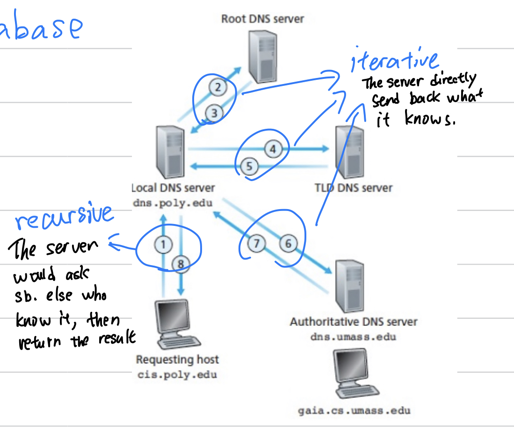

- Recursive DNS 就是每个服务器一直往后问知道有结果才一一返回
- Iterative DNS就是每个服务器一问一答，立马返回结果

### 3.4 FTP

- 双TCP连接，control connection + data connection

- control connection是长连接，端口21

- data connection是短连接，端口20，因为文件传输并不频繁，短连接够用了

## 4. 运输层

### 4.1 TCP

### 4.2 UDP

### 4.3 TLS

## 5. 网络层

### 5.1 Internet Protocol

### 5.2 Subnets 子网

### 5.3 NAT 

### 5.4 Fragmentation

## 6. 链路层

### 6.1 Medium Access Control 介质访问控制

### 6.2 Ethernet, Wireless LAN

## 7. 物理层

## 8. 网络安全

1. TCP
2. HTTP
3. 加密通信
4. IP
5. Medium Access Control
6. Ethernet/Wi-Fi
